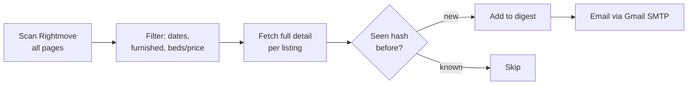

# 🏠 rent-scraper

**Stop refreshing Rightmove. Let a cron job do it at 7am and email you when something new shows up.**

A personal rental-search agent that scrapes Rightmove (and optionally Zoopla) for flats matching your exact filters — beds, price, radius, availability window — dedupes against everything you've already seen, and emails you a clean, styled digest of only the new listings.


---

## 🎯 The actual point of this thing

Rightmove and Zoopla only let you filter **"available from"** a date onwards. Neither has a way to say *"but not later than X either."* If your move has to land in a specific window — lease ends the 28th, new tenancy can't start before the 21st but you need to be in by the 20th of next month — you're on your own: open every single listing and check the move-in date by hand.

This tool filters on a **two-sided date window** (`earliest ≤ available_from ≤ latest`), applied to every listing after scraping, so the daily email only ever contains flats that are actually free when you need them — not "available now" noise, and not places that won't be ready for another six months.

## ✨ What else it does

- **Scrapes Rightmove** for every listing matching your filters, paginating through the *entire* result set (not just page one)
- **Filters precisely**: min/max beds, min/max price (pcm), radius, furnished-only, and excludes student/retirement/house-share listings
- **Dedupes intelligently**: each listing is hashed by `source:listing_id`, so a price change or re-listing doesn't trigger a repeat email — and dedup state is automatically namespaced per (recipients, filters) combo, so tweaking your search starts a clean slate without manual cleanup
- **Emails you a digest** — a nice HTML card per listing (price, beds, deposit, furnish type, council tax, description excerpt, link) plus a plain-text fallback
- **Runs unattended** via a `launchd` agent (survives sleep/wake, unlike cron) — no dashboard, no server, just your Mac and your inbox

## 📬 What it looks like


## 🧭 How it works



Run once a day (07:00 by default) via a `launchd` LaunchAgent. Each run loads a snapshot of previously-seen listing hashes, scrapes fresh results, filters out anything already emailed, sends whatever's left, and saves the updated snapshot.

## ⚠️ Zoopla support & limitations

Zoopla scraping is included (`portals/zoopla.py`, via Playwright) but is **not** part of the automated daily email — it's a manual, on-demand tool (`uv run python main.py scrape-zoopla`) that writes to a local text file. Reasons it's second-class:

- **Cloudflare-protected.** Zoopla sits behind a JS challenge. A fresh headless Chromium context passes it, but Cloudflare cuts off a context after ~2 page loads — so a new browser context is spun up for every single detail-page fetch, which is slow.
- **IP-level rate limiting.** Hammering Zoopla in a short window risks a temporary IP block. Run it sparingly (once a day, max).
- **No independent min-beds filter.** Zoopla's search URL encodes bedroom count as a single path segment (e.g. `/1-bedroom/`), not a min/max pair like Rightmove — so `min_beds` in your config has no effect on Zoopla results, only `max_beds`.
- **Min/max price** works fine (`price_min` / `price_max` are real query params).

## 🚀 Setup

```bash
git clone <this-repo>
cd rent-scraper
uv sync
uv run playwright install chromium   # only needed for Zoopla
```

**1. Configure your search:**

```bash
cp config.example.py config.py
```

`config.py` is gitignored — it's yours to edit freely and it'll never end up in a commit. Fill in:

| Field | Meaning |
|---|---|
| `RIGHTMOVE_LOCATION_ID` / `RIGHTMOVE_LOCATION_NAME` | Find via a manual Rightmove search — copy `locationIdentifier` from the URL |
| `FILTERS.max_beds` / `min_beds` | Bedroom range (`min_beds=None` = no minimum) |
| `FILTERS.max_price_pcm` / `min_price_pcm` | Monthly rent range in GBP |
| `FILTERS.radius_miles` | Search radius from the location |
| `FILTERS.available_from` | `DateWindow(earliest=..., latest=...)` — the two-sided filter described above |
| `FILTERS.furnished_only` | Requires furnished; also excludes listings later confirmed unfurnished |
| `EMAIL_SENDER` / `EMAIL_RECIPIENTS` | Gmail address to send from / list of recipients |

**2. Add your Gmail app password** — generate one at [myaccount.google.com/apppasswords](https://myaccount.google.com/apppasswords), then:

```bash
echo "your-16-char-app-password" > secret.txt
```

`secret.txt` is gitignored and read at runtime — it's never hardcoded or committed.

**3. Try it manually:**

```bash
uv run python main.py            # print search URLs (sanity check your filters)
uv run python run.py             # one full scrape + email run
```

**4. Automate it** — a `launchd` LaunchAgent (macOS) runs `run.py` daily and survives sleep/wake, unlike `cron`. See the plist template pattern in the setup notes, drop it in `~/Library/LaunchAgents/`, then:

```bash
launchctl bootstrap gui/$(id -u) ~/Library/LaunchAgents/com.yourname.rent-scraper.plist
```

## 🗂️ Project structure

```
config.example.py      template — copy to config.py (gitignored) and fill in your own values
filters.py             SearchFilters / DateWindow dataclasses
models.py              Listing dataclass
notifier.py            hashing, dedup snapshot, HTML/text email rendering + send
portals/
  rightmove.py         Rightmove search + detail scraping (httpx)
  zoopla.py            Zoopla search + detail scraping (Playwright, Cloudflare bypass)
run.py                 cron entry point: scrape → dedup → email
scraper.py             standalone Rightmove CLI → results.txt
zoopla_scraper.py      standalone Zoopla CLI → zoopla_results.txt
main.py                CLI dispatcher (urls / scrape / scrape-zoopla / scrape-all)
tests/                 85 tests covering filters, parsers, dedup, snapshotting
```

## ✅ Code quality

```bash
uv run --group dev ruff check .    # lint
uv run --group dev mypy .          # strict type checking
uv run --group dev pytest -q       # 85 tests
```

## ⚖️ Disclaimer

This is a personal-use tool for checking listings you're personally interested in. It scrapes public search-result pages at a deliberately slow, human-scale pace (rate-limited requests, no parallelism). Rightmove's and Zoopla's terms of service restrict automated access — use at your own discretion, don't hammer their servers, and don't use this for anything beyond your own personal search.
