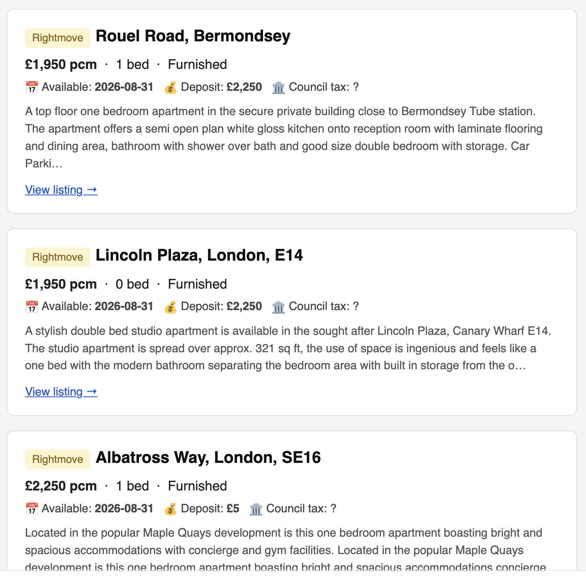
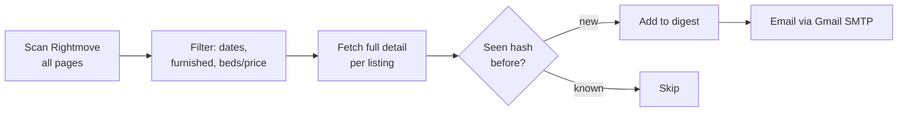

# 🏠 rent-scraper

**Stop refreshing Rightmove. Let a cron job do it at 7am and email you when something new shows up.**

A personal rental-search agent that scrapes Rightmove (and optionally Zoopla) for flats matching your exact filters — beds, price, radius, availability window — dedupes against everything you've already seen, and emails you a clean, styled digest of only the new listings.


---

## 🎯 The actual point of this thing

Rightmove and Zoopla only let you filter **"available from"** a date onwards. Neither has a way to say *"but not later than X either."* If your move has to land in a specific window — lease ends the 28th, new tenancy can't start before the 21st but you need to be in by the 20th of next month — you're on your own: open every single listing and check the move-in date by hand.

This tool filters on a **two-sided date window** (`earliest ≤ available_from ≤ latest`), applied to every listing after scraping, so the daily email only ever contains flats that are actually free when you need them — not "available now" noise, and not places that won't be ready for another six months.

## ✨ What else it does

- **Scrapes Rightmove** for every listing matching your filters, paginating through the *entire* result set (not just page one)
- **Filters precisely**: min/max beds, min/max price (pcm), radius, furnished-only, and excludes student/retirement/house-share listings
- **Dedupes intelligently**: each listing is hashed by `source:listing_id`, so a price change or re-listing doesn't trigger a repeat email — and dedup state is automatically namespaced per (recipients, filters) combo, so tweaking your search starts a clean slate without manual cleanup
- **Emails you a digest** — a nice HTML card per listing (price, beds, deposit, furnish type, council tax, description excerpt, link) plus a plain-text fallback
- **Runs unattended** via a `launchd` agent (survives sleep/wake, unlike cron) — no dashboard, no server, just your Mac and your inbox

## 📬 What it looks like



## 🧭 How it works



Run once a day (07:00 by default) via a `launchd` LaunchAgent. Each run loads a snapshot of previously-seen listing hashes, scrapes fresh results, filters out anything already emailed, sends whatever's left, and saves the updated snapshot.

## ⚠️ Zoopla support (experimental)

Rightmove is the primary, supported path. Zoopla scraping is included (`portals/zoopla.py`, via Playwright) but is **experimental and disabled by default** — it's never part of the automated daily email, only a manual, on-demand command (`uv run python main.py scrape-zoopla`) that writes to a local text file. Treat it as best-effort:

- **Anti-bot protection.** Zoopla uses anti-bot measures that automated access may trip. The Playwright path can be slow, return nothing, or stop working entirely at any time — don't rely on it.
- **Run it sparingly and politely.** Requests are deliberately slow and single-threaded; be respectful of the site and don't hammer it.
- **No independent min-beds filter.** Zoopla's search URL encodes bedroom count as a single path segment (e.g. `/1-bedroom/`), not a min/max pair like Rightmove — so `min_beds` in your config has no effect on Zoopla results, only `max_beds`.
- **Min/max price** works fine (`price_min` / `price_max` are real query params).

## 🚀 Setup

```bash
git clone <this-repo>
cd rent-scraper
uv sync
uv run playwright install chromium   # only needed for Zoopla
```

**1. Configure your search:**

```bash
cp config.example.yaml config.yaml
```

`config.yaml` is gitignored — it's yours to edit freely and it'll never end up in a commit. Fill in:

| Key | Meaning |
|---|---|
| `rightmove.location_id` / `location_name` | Find via a manual Rightmove search — copy `locationIdentifier` from the URL |
| `zoopla.location` | `"<place>, London"` — only used by the experimental `scrape-zoopla` command |
| `filters.max_beds` / `min_beds` | Bedroom range (`min_beds: null` = no minimum) |
| `filters.max_price_pcm` / `min_price_pcm` | Monthly rent range in GBP |
| `filters.radius_miles` | Search radius from the location |
| `filters.available_from` | `earliest` / `latest` — the two-sided date window described above |
| `filters.furnished_only` | Requires furnished; also excludes listings later confirmed unfurnished |
| `email.sender` / `email.recipients` | Gmail address to send from / list of recipients |

Keep several searches side by side (e.g. `work.yaml`, `weekend.yaml`) and pick one per run:

```bash
RENT_SCRAPER_CONFIG=work.yaml uv run python run.py
```

**2. Add your Gmail app password** — generate one at [myaccount.google.com/apppasswords](https://myaccount.google.com/apppasswords), then:

```bash
echo "your-16-char-app-password" > secret.txt
```

`secret.txt` is gitignored and read at runtime — it's never hardcoded or committed.

**3. Try it manually:**

```bash
uv run python main.py            # print search URLs (sanity check your filters)
uv run python run.py             # one full scrape + email run
```

**4. Automate it** — a `launchd` LaunchAgent (macOS) runs `run.py` daily and survives sleep/wake, unlike `cron`. Save the template below to `~/Library/LaunchAgents/com.yourname.rent-scraper.plist`, editing the two `/absolute/path/to` values and the `uv` path (`which uv`) for your machine:

```xml
<?xml version="1.0" encoding="UTF-8"?>
<!DOCTYPE plist PUBLIC "-//Apple//DTD PLIST 1.0//EN" "http://www.apple.com/DTDs/PropertyList-1.0.dtd">
<plist version="1.0">
<dict>
  <key>Label</key><string>com.yourname.rent-scraper</string>
  <key>ProgramArguments</key>
  <array>
    <string>/opt/homebrew/bin/uv</string>
    <string>run</string>
    <string>python</string>
    <string>run.py</string>
  </array>
  <key>WorkingDirectory</key><string>/absolute/path/to/rent-scraper</string>
  <key>StartCalendarInterval</key>
  <dict><key>Hour</key><integer>7</integer><key>Minute</key><integer>0</integer></dict>
  <key>StandardOutPath</key><string>/absolute/path/to/rent-scraper/data/cron.log</string>
  <key>StandardErrorPath</key><string>/absolute/path/to/rent-scraper/data/cron.log</string>
</dict>
</plist>
```

Then load it:

```bash
launchctl bootstrap gui/$(id -u) ~/Library/LaunchAgents/com.yourname.rent-scraper.plist
```

## 🗂️ Project structure

```
config.example.yaml    template — copy to config.yaml (gitignored) and fill in your own values
config.py              loads config.yaml into typed SearchFilters/DateWindow objects
filters.py             SearchFilters / DateWindow dataclasses
models.py              Listing dataclass
notifier.py            hashing, dedup snapshot, HTML/text email rendering + send
portals/
  rightmove.py         Rightmove search + detail scraping (httpx)
  zoopla.py            Zoopla search + detail scraping (Playwright, experimental)
run.py                 cron entry point: scrape → dedup → email
scraper.py             standalone Rightmove CLI → results.txt
zoopla_scraper.py      standalone Zoopla CLI → zoopla_results.txt
main.py                CLI dispatcher (urls / scrape / scrape-zoopla / scrape-all)
tests/                 85 tests covering filters, parsers, dedup, snapshotting
```

## ✅ Code quality

```bash
uv run --group dev ruff check .    # lint
uv run --group dev mypy .          # strict type checking
uv run --group dev pytest -q       # 85 tests
```

## ⚖️ Disclaimer

This is a personal-use tool for checking listings you're personally interested in, provided as-is for educational purposes.

- **Not affiliated.** This project is not affiliated with, endorsed by, or connected to Rightmove or Zoopla in any way. All trademarks belong to their respective owners.
- **You are responsible for compliance.** Rightmove's and Zoopla's terms of service restrict automated access. You are responsible for complying with each website's terms and applicable law — use at your own discretion and risk.
- **Personal, non-commercial use only.** Don't use this commercially, run it as a service, or build a product on top of it.
- **Be respectful.** It scrapes public search-result pages at a deliberately slow, human-scale pace (rate-limited requests, no parallelism). Don't hammer their servers.

## 📄 License

[PolyForm Noncommercial License 1.0.0](LICENSE) — you're free to use, study, and modify this for **non-commercial** purposes. Commercial use is not permitted.
